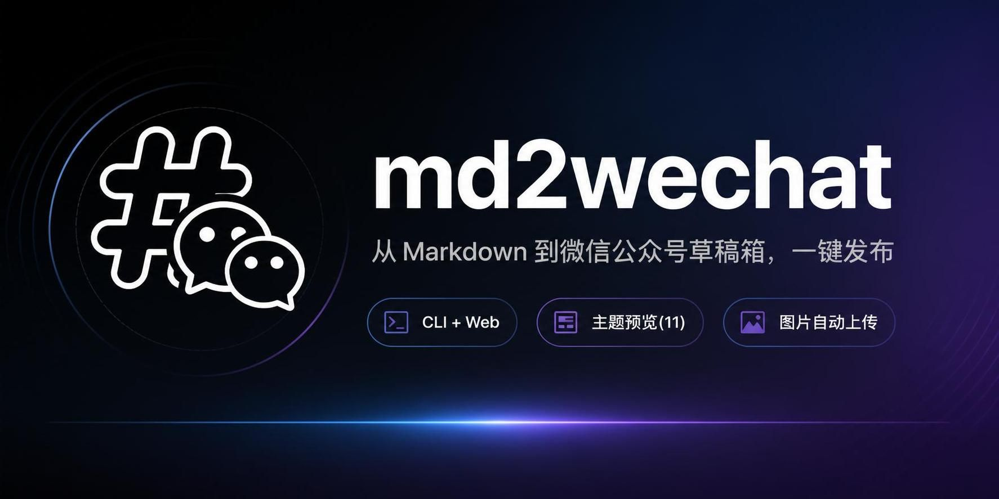

<div align="center">

# 📝 md2wechat



### 从 Markdown 到微信公众号草稿箱，一行命令 / 一次点击

**免费 · 开源 · 本地运行 · 批量发布**

[](https://www.typescriptlang.org/)
[](https://nodejs.org/)
[](https://opensource.org/licenses/MIT)
[](https://mp.weixin.qq.com/)
[](https://github.com/jiabao-wang/md2weichat/pulls)

**不用再为公众号排版掉头发了 —— 本地写完 Markdown，一键发送到草稿箱，拿起手机群发即可。**

[✨ 功能特性](#-功能特性) · [🚀 快速开始](#-快速开始) · [📖 使用方式](#-使用方式) · [🎨 主题预览](#-主题预览) · [📦 批量发布](#方式一可视化-web-界面推荐新手) · [❓ FAQ](#-常见问题)

</div>

---

<p align="center">
<b>⚡ 实时预览</b> · <b>🎨 11 套主题</b> · <b>💻 代码高亮 + 手机端完美换行</b> · <b>🖼️ 图片自动上传</b> · <b>📦 批量发布</b> · <b>🔧 CLI + Web 双模式</b>
</p>

---

## ✨ 功能特性

- 🚀 **一键发布草稿箱** — 转换 + 上传图片 + 封面 + 创建草稿，一步到位
- 🎨 **11 种精美主题** — 默认绿、优雅红、科技蓝、金融时报、纽约时报、GitHub、Claude、学术论文、激光玻璃、轻奢金、赛博朋克
- 🖥️ **可视化 Web 界面** — 在线编辑 Markdown，实时预览，所见即所得
- 📦 **批量发布** — 选目录或多选文件，批量上传草稿，失败可单独重试
- 💻 **命令行工具** — 支持 CI/CD 集成，脚本化操作
- 🖼️ **图片自动上传** — 自动将本地图片上传到微信素材库并替换链接
- 📱 **移动端适配** — 代码块自动换行、列表无多余符号，手机端显示完美
- 🔒 **本地安全** — AppID/AppSecret 仅保存在本地，不上传任何第三方服务器
- 🎯 **代码高亮** — 基于 highlight.js，支持 190+ 语言语法高亮
- 📐 **Front Matter** — 支持 YAML 头部设置标题、作者、主题、封面等元信息

## 🚀 快速开始

### 环境要求

- Node.js ≥ 16
- 微信公众号（订阅号/服务号均可，需已认证以获取素材上传权限）

### 安装

```bash
# 克隆项目
git clone https://github.com/jiabao-wang/md2weichat.git
cd md2wechat

# 安装依赖
npm install

# 构建
npm run build

# 全局链接（可选，方便任意目录使用 md2wechat 命令）
npm link
```

### 配置微信凭证

1. 登录 [微信公众平台](https://mp.weixin.qq.com)
2. 进入 **开发 → 基本配置**，获取 AppID 和 AppSecret
3. 将你的服务器 IP 添加到 **IP白名单**（本地开发可查看当前出口IP）

```bash
# 方式一：命令行配置
md2wechat config wx你的AppID 你的AppSecret

# 方式二：Web 界面中点击⚙️设置按钮配置
md2wechat web
```

### 启动可视化界面（推荐）

```bash
md2wechat web
# 或 npm run dev（开发模式，自动打开浏览器）
npm run dev -- web
```

浏览器自动打开 `http://localhost:3000`，即可开始使用！

## 📖 使用方式

### 方式一：可视化 Web 界面（推荐新手）

```bash
md2wechat web
```

| 功能 | 说明 |
|------|------|
| ✏️ 单篇编辑 | 在线编辑 Markdown，实时预览，一键发布 |
| 📦 批量发布 | 选择目录/多选文件，每篇独立设置封面，进度条展示，失败重试 |
| 🎨 主题切换 | 11 种主题即时切换预览 |
| ⚙️ 配置管理 | 在界面中直接设置 AppID/AppSecret |

#### Markdown Front Matter 支持

在 `.md` 文件开头添加 YAML 头部：

```markdown
---
title: 文章标题
author: 作者名
digest: 文章摘要
theme: github
cover: ./images/cover.jpg
---

# 正文开始...
```

### 方式二：命令行

```bash
# 转换并预览（不发布）
md2wechat convert article.md --preview

# 转换并保存 HTML 文件
md2wechat convert article.md -o output.html -t github

# 转换并发布到草稿箱
md2wechat convert article.md --draft --cover ./cover.jpg

# 指定主题
md2wechat convert article.md --draft -t cyberpunk

# 列出所有可用主题
md2wechat themes

# 查看当前配置
md2wechat config
```

### CLI 命令一览

| 命令 | 说明 |
|------|------|
| `md2wechat init` | 初始化配置文件 |
| `md2wechat config [appid] [secret]` | 查看/设置微信凭证和默认主题 |
| `md2wechat themes` | 列出所有可用主题 |
| `md2wechat convert <file>` | 转换 Markdown 文件（支持 `-t` 主题、`-o` 输出、`-p` 预览、`-d` 发布草稿、`-c` 封面） |
| `md2wechat inspect <file>` | 检查 Markdown 文件元数据 |
| `md2wechat web [-p port]` | 启动可视化 Web 界面 |

## 🎨 主题预览

| 主题 | 风格 |
|------|------|
| 默认绿 | 微信绿主色调，清新简洁 |
| 优雅红 | 经典红色标题线，适合情感/观点类 |
| 科技蓝 | 蓝色科技感，适合技术文章 |
| 金融时报 | FT 标志性品红色，衬线字体，报纸排版 |
| 纽约时报 | NYT 经典衬线体，严肃新闻风 |
| GitHub | GitHub 官方配色，代码阅读舒适 |
| Claude | Anthropic Claude 风格暖米色 |
| 学术论文 | 宋体/Times New Roman，首行缩进，论文排版 |
| 激光玻璃 | 青-紫-粉渐变，磨砂玻璃效果，霓虹感 |
| 轻奢金 | 金色装饰线，衬线字体，古典奢华 |
| 赛博朋克 | 赛博红/紫/深青，矩阵绿代码块，霓虹边框 |

## 🏗️ 项目架构

```
md2wechat/
├── src/
│   ├── cli/           # 命令行入口
│   ├── core/
│   │   ├── markdown.ts   # Markdown 解析（marked + highlight.js + 代码换行修复）
│   │   ├── renderer.ts   # HTML 渲染 + CSS 内联（juice）+ 安全清洗
│   │   ├── themes.ts     # 11 套主题 CSS
│   │   └── converter.ts  # 核心转换流程
│   ├── wechat/
│   │   ├── client.ts     # 微信 API 客户端（access_token 管理）
│   │   ├── media.ts      # 素材上传（图片/封面）
│   │   └── draft.ts      # 草稿箱创建
│   ├── web/
│   │   └── server.ts     # Express 后端 API
│   └── config/          # 配置管理（本地存储）
├── public/
│   └── index.html       # Web 前端界面（单文件）
├── cover/
│   └── cover.jpeg       # 默认封面
└── examples/            # 示例 Markdown 文件
```

### 核心流程

```
Markdown 文件
    ↓ marked 解析（自定义 listitem/code 渲染器）
    ↓ highlight.js 语法高亮 + 逐行 section 包裹（解决代码换行）
    ↓ cheerio 后处理（清理空列表项/危险标签/p标签）
HTML 片段
    ↓ 注入主题 CSS + hljs CSS
    ↓ juice CSS 内联（微信不支持 <style> 标签）
    ↓ sanitize（移除微信拦截的链接/JS）
公众号 HTML
    ↓ 上传本地图片到微信素材库 → 替换 URL
    ↓ 上传封面图获取 thumb_media_id
    ↓ 调用 /draft/add 接口
草稿箱 ✅
```

## ❓ 常见问题

### Q: 为什么需要 IP 白名单？
微信公众平台的 API 出于安全考虑，要求将调用方服务器 IP 添加到白名单才能获取 access_token。本地开发时，可访问 [ip.cn](https://ip.cn) 查看出口IP后添加。

### Q: 个人订阅号可以用吗？
个人订阅号已认证即可使用素材上传和草稿接口。未认证的订阅号接口权限有限，可能无法上传永久素材。

### Q: 代码块在手机端显示正常吗？
已做深度适配：
- 每一行代码被包裹为独立块级元素 `<section>`，不依赖 CSS `white-space`
- 使用 `word-break: break-word` 而非 `break-all`，不会在 `/`、`→` 等符号处断行
- 空行保留高度，代码缩进完整

### Q: 支持自定义主题吗？
在项目根目录创建 `themes/` 文件夹，放入 `.css` 文件即可在 Web 界面中选用。CSS 需以 `.wechat-article` 为根选择器。

### Q: 发布失败提示 "invalid content hint (45166)"？
这是微信的内容安全拦截。已自动处理：
- CSS 样式全部内联（无 `<style>` 标签）
- 自动移除指向 `mp.weixin.qq.com` 的链接（会触发安全策略）
- 移除 `<script>`、`<iframe>` 等危险标签

### Q: 批量发布时如何设置统一作者/主题？
在批量发布页面顶部设置"全局默认作者"和"默认主题"，加载文件时会自动填充；每个文件可以单独修改覆盖。

## 📄 License

MIT License - 详见 [LICENSE](LICENSE) 文件

---

<div align="center">

**如果这个工具帮到了你，欢迎 Star ⭐ 支持一下！**

</div>
